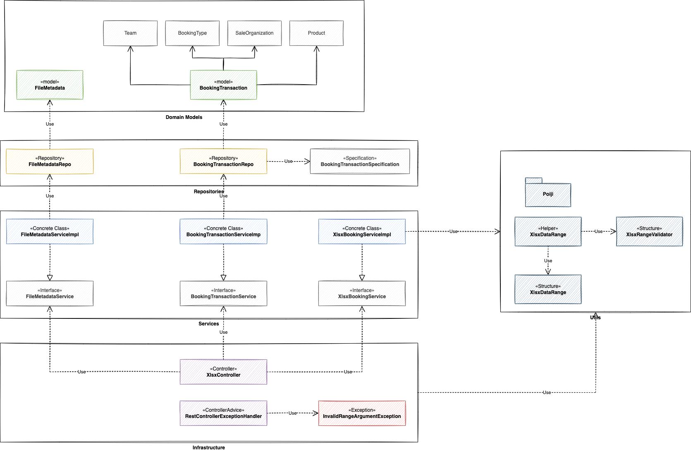

# Table of contents

1. Introduction
2. Prerequisites
3. Getting started
4. Using Postman for testing APIs
5. Code design diagram

# 1. Introduction
***

### XLSX Import
Create Spring boot-based app with the following API endpoints.
> [POST] /upload  - Provides the ability to upload XLSX (from Excel, not CSV)

Other parameters to help extract data from XLSX file are the **worksheet’s name** and selected area 
string, for example, **A1:D20**, to mark the rectangle that will be imported.

After a file is uploaded, file metadata is stored in DB table (name, creation date, size, upload date)
Data from XLSX file is added into the corresponding table in DB, excluding duplicates by field OpportunityID.

> [GET] /opportunity - Returns all objects if no filter is applied.

Add parameters to filter by team, product, bookingtype and date range (startDate, endDate based on bookingdate field

# 2. Prerequisites
***

1. Git
2. Java 11
3. Maven
4. IntelliJ IDE preferably or any other Java IDE

# 3. Getting started
***

### Get the code
Clone the repository on a local machine.

### Run the code

1. Run ```docker-compose up -d``` to fire up PostgreSQL docker (from docker folder)
2. Run ```mvn clean install```
3. Run ```mvn spring-boot:run```

# 4. Using Postman for testing APIs
***

I use Postman for requesting the external APIs to see if they behave as expected.
The Postman collections can be found inside of ```postman_collections``` folder.

### Structure of the collection
- **Upload**
  - Upload with all valid parameters
  - Upload with invalid file parameter
  - Upload with invalid range parameter
  - Upload without file parameter
  - Upload without range parameter
  - Upload without worksheet parameter
- **Opportunity**
  - Opportunity with all filters
  - Opportunity with booking type filter
  - Opportunity with team filter
  - Opportunity with product filter
  - Opportunity with start date filter
  - Opportunity with end date filter
  - Opportunity with invalid start date filter
  - Opportunity with invalid end date filter

# 5. Code design diagram
***

  
